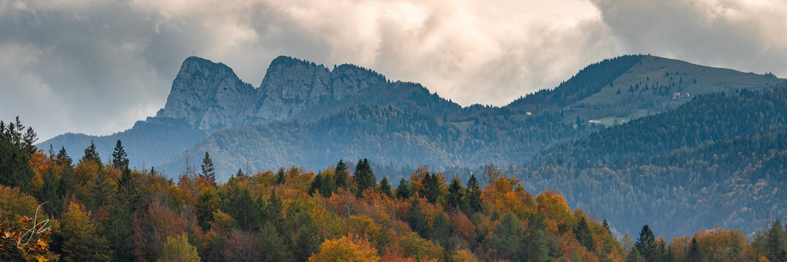

## Welcome
My name is Zeno. I am studying computer science in Trento. Oh yes, and I am really into photography (though I am just an amateur who is constantly improving) and rock climbing. And mountain biking. And playing the flute. And skiing. And tabletop games such as Scythe. And cats.

<kbd></kbd>

## Skills at a glance

  <h4>Computer programming</h4>
  

  <h4>Others</h4>
  
  

### Programming-oriented projects
* [ands](https://github.com/zenosaltt/ands): common algorithms and data structures written in C++.
<!-- [ngn-repo](https://github.com/zenosaltt/ngn-repo): a cognitive wifi radio infrastructure based on GNU Radio. _Next Generation Networks_ exam project. -->

### LaTeX Notes
* [phy](https://github.com/zenosaltt/phy): physics notes and LaTeX template;
* [fmi](https://github.com/zenosaltt/fmi): _Fondamenti Matematici per l'Informatica_

<!--  -->