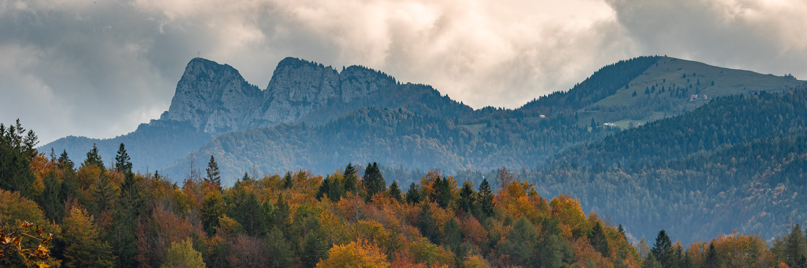

# Welcome, my name is Zeno
<kbd></kbd>

### Some interesting notes
* [phy](https://github.com/zenosaltt/phy): physics notes and LaTeX template;
* [fmi](https://github.com/zenosaltt/fmi): _Fondamenti Matematici per l'Informatica_

<!--  -->

<!--
**zenosaltt/zenosaltt** is a ✨ _special_ ✨ repository because its `README.md` (this file) appears on your GitHub profile.

Here are some ideas to get you started:

- 🔭 I’m currently working on ...
- 🌱 I’m currently learning ...
- 🤔 I’m looking for help with ...
- 💬 Ask me about ...
- 📫 How to reach me: ...
- ⚡ Fun fact: ...
-->
