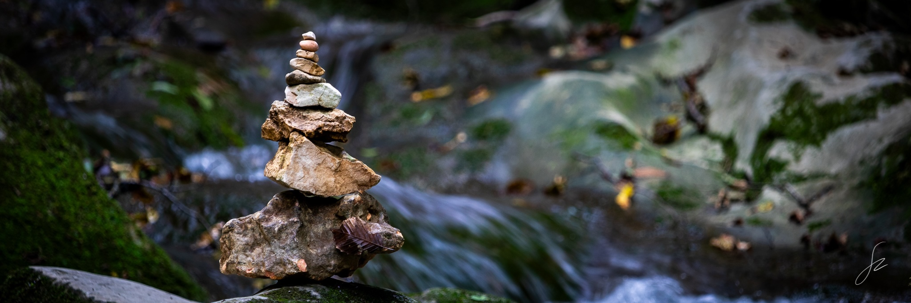

# Welcome
<!-- My name is Zeno. I am studying computer science in Trento. I am really into photography, cinematography and rock climbing. And mountain biking. And playing the flute. And skiing. And tabletop games. And cats. -->

<kbd></kbd>

## Skills at a glance

  <h4>Computer programming</h4>
  

  <h4>Miscellaneous</h4>
  
  <!--
  
  -->

### Programming-oriented projects
* [ands](https://github.com/zenosaltt/ands): common algorithms and data structures written in C++.
<!-- [ngn-repo](https://github.com/zenosaltt/ngn-repo): a cognitive wifi radio infrastructure based on GNU Radio. _Next Generation Networks_ exam project. -->

### LaTeX Notes
* [phy](https://github.com/zenosaltt/phy): physics notes and LaTeX template;
* [fmi](https://github.com/zenosaltt/fmi): _Fondamenti Matematici per l'Informatica_

<!--
## Furthermore...
I am really into many things; (only) a few examples:
* I am an amateur flutist currently playing with two bands, mainly as non-principal and occasionally as principal
* I am fond of photography, cinematography and literature
* Table-top games
* Skiing
-->

<kbd></kbd>
